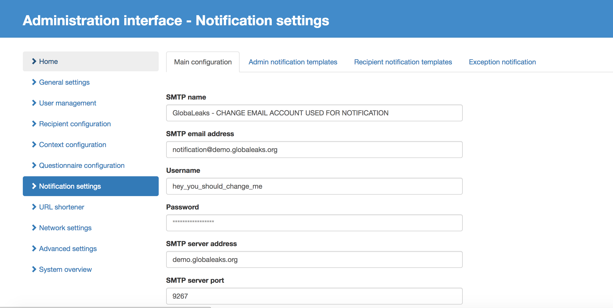

===================
Configuration Guide
===================

It is possible to tweak every aspect of your GlobaLeaks installation by accessing to the Admin interface available at:

http://localhost:8082/#/admin

.. image:: admin0.png

To log in as administrator, use the admin credentials created at STEP 4 of the First Configuration Guide (todo: insert cross reference with the mentioned doc).

The admin interface shows all the configurable options:

.. image:: admin1.png

By clicking on "General" in the menu on the left of the page, it will be possible to access to the different tabs that allows to configure and customize the GlobaLeaks node in its every aspect:

.. image:: admin2.png

Add a logo and a favicon
-------------------------

The first thing you want to give to your GlobaLeaks installation is its identity by adding a logo and a favicon. 

To add the logo select the "Theme Customisation" tab, click on "+upload" button under "Project Logo" and select from your disk an image of your desired logo in .png format, dimension 140x140 pixels

To add the favicon, in the same "Theme Customisation" tab, click on "+upload" button under "Project favicon" and select from your local disk a favicon image in .png format

.. image:: admin3.png

Scroll down along the page to reach the "Save" button, click on it and have your logo and favicon applied.

.. image:: admin4.png

Select Additional Languages
---------------------------

You may want your GlobaLeaks installation served on more than one language, other the one selected as primary during First Configuration (todo: insert cross reference).

To do so, in the "Administration Interface - General Settings" page, select the "Languages" tab: a list of all available languages in shown. Select the alternative choosen langauge(s) and scroll down trhrough the page to the "Save" button, click it to save your choices.

Note that in the same interface you can change, through a drop down menu, the default language in which GlobaLeaks installation is served.

.. image:: admin5.png

Configure HTTPS
---------------

It is quite important to configure HTTPS for your GlobaLeaks installation. Nowadays, every website should protect its users with HTTPS, and this is so much true for a whistleblowing system. HTTPS helps prevent malicioous actors from tampering the communications between your GlobaLeaks installation and the browser of the users.

To configure HTTPS, go to "Administration interface - Network settings" and select the "HTTPS Settings" tab. If not already filled with the hostname of the GlobaLeaks installation you are configuring, just fill the "Hostname" field with the FQDN and click on the "Verify" button.

.. image:: HTTPS_Conf_1.png

If the verification process is successful, just click on the "Proceed" button; otherwise, you have to verify that the domain name you choose is correctly set up. Keep in mind that domain name propagation over DNS can take some time.

.. image:: HTTPS_Conf_2.png

You then have to choose among two proposed options:

- **Automatic** : the entire process of requesting, enabling and renewing certificates will be handled from the Let's Encrypt Certificate Authority. The parent organization, the Internet Security Research Group, is committed to providing the service for free. (You can read more about this on https://letsencrypt.org)
  
- **Manual** : if you already have a certificate from a Certificate Authority, this is your option. A wizard will guide you through the process of installing said certificate

Automatic HTTPS Configuration
.............................

To configure HTTPS the easy way, with free certificate from Let's Encrypt (https://letsencrypt.org), just click on the "Proceed" button in the "Automatic" box

.. image:: HTTPS_Config_Automatic_Option_1.png

This can take a little and the "loading" symbol is shown

.. image:: HTTPS_Config_Automatic_Option_2.png

When ready, the system will prompt you to read the Term of Service from the Let's Encrypt site by clicking on the button "Read the Term of Service".
If you agree to accept said TOS, check the checkbox "I agree to the Term of Service" and click on the "Proceed" button, this will start the automatic generation and installation of the Certificate. 

.. image:: HTTPS_Config_Automatic_Option_3.png

When this process is completed, you will be prompted to immediately activate the configuration by clicking on the "Enable" button, or review the configuration by clicking on "Review" button.

.. image:: HTTPS_Config_Automatic_Option_4.png

Manual HTTPS Configuration
..........................

.. ATTENTION::
  Choose this option only if you know what you are doing  

.. image:: HTTPS_Config_Manual_Option_1.png

  
The interface can generate the Private Key and the Certificate Signing Request. The Certificate Signing Request has to be provided to a Certificate Authority (usually, your ISP can help you with this) to retrieve a Certificate. After having validated your request and your ownership of the hostname, the Certificate Authority will issue you a Certificate and provide a file containing Intermediate Certificates. 
Load both the Certificate and the file containing the Intermediate Certificates to complete the HTTPS setup. 

.. HINT::
  Please note that the file format expected for all files uploaded is PEM. Sometimes Certificate Authorities will provide certificates in DER format which must be converted to PEM.

Configure Recipients
--------------------

In the "First Configuration Guide" we have seen how to create a Recipient (or Receiver).
The Recipient is the person that will receive and process the data that whistleblowers input in the platform.
You can have one or multiple Recipients per Context, and also have one Recipient that can access to multiple Contexts. The platform is very flexible on this and allows you to define in very detail your whistleblowing system and procedure.

.. IMPORTANT::
  This part has to be completed

  
Configure Context
-----------------

In the "First Configuration Guide" we have seen how to create a Context.

The context is sort a conceptual container of your whistleblowing initiative. To better understand this, just think about a whistleblowing initiative devoted to gather information about ethical misconducts infringing the ethical code of a governmental agency or of a company. When you configure the Context you will assign to it a name that can be evocative of the mission related to this context so that the whistleblowers know that this is the right place where to communicate their data. Then you would like to describe in more detail the context itself, so that whistleblower are informed that this is part of a whole process in which specific persons, the receivers, will receive and follow up on the data they're submitting.

To configure a Context, log in as an admin, go to the administration interface, select "Context configuration" in the menu on the left of the page and fill the text field with the name choosen for the Context, then click on "Add" button.

.. image:: Context_conf_1.png

Then you will see that the new Context is addedd to the page and to access the configuration interface for this context, click on the "Edit" button.

.. image:: Context_conf_2.png

The configuration interface specific of the selected context is shown and you can proceed with filling of the various field.

.. image:: Context_conf_3.png

The most important field in this section at this stage of the configuration process is surely the "Text shown on top of the interface for selecting recipients": this text will be shown in the interface exposed to the whistleblowers. So be sure to use suitable and appealing terms and phrases and be clear in explaining which data are accepted, who will be the recipients, which is the follow up of the submitted data. Just think of this text as the main tool to convince your source to submit data through this channel.
Once completed this task, click on "Save" button.
You can verify the appearance by visiting ...

.. IMPORTANT::
  This part is work in progress

Configure Email Notification
----------------------------

GlobaLeaks sends out notifications of different events to different receivers and to admins. In order to have this working, you have to select  "Notification Settings" in the "Administration Interface - General Settings" page and set up email account and related server parameters.

We suggest you to setup an email account dedicated to sending out notifications from your initiative.

Enter the followings:

- SMTP name: the name of your GlobaLeaks project or something that equally descriptive
- SMTP email address: the email address used to send notifications
- Username: the username corresponding to the just inserted "SMTP email address"; this is needed to authenticate to the SMTP server and send emails
- Password: Password of the above corresponding "SMTP email address"
- SMTP Server Address: it is the hostname of the SMTP server you are using to send notification emails
- SMTP Server Port: Port used to send outgoing emails. It is usually 465 or 587 (SMTP with TLS is at TCP port 587; SMTP with SSL is at 465)
- Transport Security: from the drop down menu select the opportune security level 

.. image:: notification_settings_2.png

It is better to leave untouched the pre-defined settings pertaining the notification to admins and to recipients, but in the case you want to disable them, it is possibile to check the corresponding checkboxes.

You can then set the value for the time at which the notification alert of expiring submission; this value is set at 72hours to give time to the recipient(s) to check and manage the pending submissions.

It is possible to tweak the maximum number of emails allowed in an hour, before email wil be suspended in order to avoid flooding the system. It is advised to keep the pre-defined value, and eventually change it accordingly with mail server capabilities.

Once configured all the parameters for notifications, it is possible to test them by just clicking on the "Test the configuration" button. 

If all is working as expected, click on the "Save" button to keep the configured parameters.

.. IMPORTANT::
  This section is work in progress!
