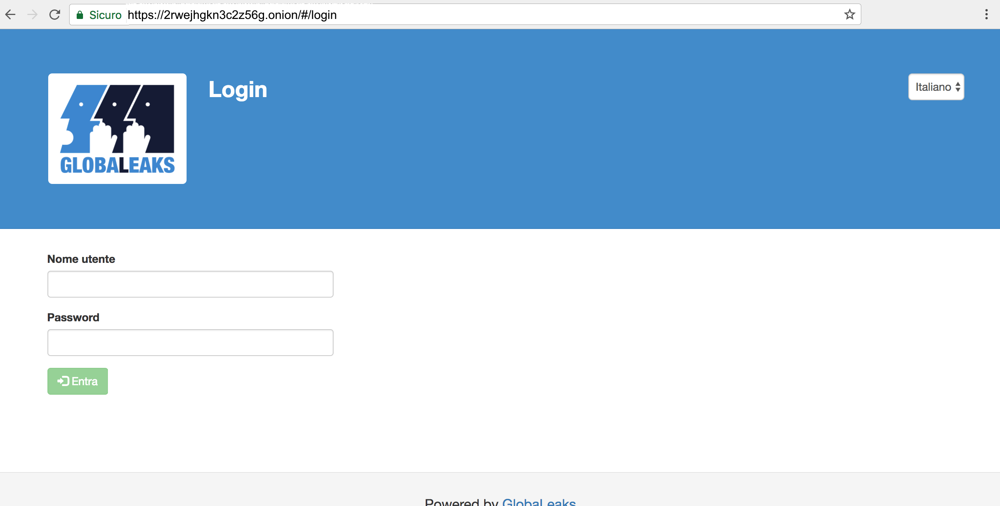

===================
Configuration Guide
===================

Configure your GlobaLeaks installation and make it capable of receiving anonymous submissions that get dispatched to configured recipients.

STEP 1 - Access Authentication interface
----------------------------------------
The authentication interface is where you can log in. Both admin and recipients can authenticate with username and password.

You can reach the authentication interface with your browser in two ways:

- From the same computer you installed GlobaLeaks on:

  Example: http://127.0.0.1:8082/#/login

- or, from your Tor Hidden Service hostname with Tor Browser:

  Example: http://2rwejhgkn3c2z56g.onion/#/login

.. note::
   Loading the interface may take a while, due to the High Latency of Tor Hidden Service.
   
   

This will bring you to the page for "Step-by-step setup"

Choose the primary language for the site. The default choice is English, but many others are available.

Once selected, click "next".

The second page will bring you to the setup of your project. Needed fields are, by section:

- "General", section Project name Project description

- "Admin" section

- email address password password confirmation

- "Recipient" section

- Name Email address Password PGP Key Option: Enable insecure configuration without PGP encryption.

- "Context" section

Name

Once this is done, a "next step" button will appear. Click on it when ready.

STEP 2 - Login as admin

You should login to the admin interface of your GlobaLeaks node. Link http://your-url:your-port/#/admin/landing

Login with the following default credentials:

Username: admin
Password: globaleaks
STEP 3 - Change your admin password

Click on Admin Password . As a first step you should change the default GlobaLeaks password.

Change your password by filling:

Old Password: globaleaks
New Password: YourOwnChoosenPassword
STEP 4 - Configure GlobaLeaks basic data

Click on Content Settings . The time has come to set up the basic branding information about your node.

Logo: Upload an image of 140x140 pixels, in PNG-format
Select File
Click Upload
Node Name: The name of your initiative (will appear in the header)
Node Subtitle: The payoff to be shown under your Node Name (will appear in the header)
Description: Information about your initiative (will appear in the header)
Email: The email to the initiative maintainer (Currently not used by the software)
Presentation: The text shown on the landing page that users are presented with.
Footer: A small text shown at the bottom of each page
Tor Hidden Service: Your Tor Hidden Service hostname with HTTP:// (Used in notification email)
Tor2web Public Site: Your Tor2web Public Site with HTTPS:// (Used in notification email)
Please consider that currently GlobaLeaks does only allow "text" editing with no formatting or URL-linking. Work is underway to enable editing with a dual WYSIWYG rich text editor, along with markdown manual tweaking as per https://github.com/globaleaks/GlobaLeaks/issues/618 .

STEP 5 - Configure Email Notification

Click on Notification Settings . Set up email account and related server parameters, used by GlobaLeaks to send out notifications related to submissions to recipients.

We suggest you to setup an email account dedicated to sending out notifications from your initiative.

Enter the following data:

Username: Address of the email account used as a username to send email and authenticate with
Password: Password of the email account
SMTP Server: Outgoing server (SMTP) used to send emails from this account
SMTP Port: Port used to send outgoing email (may be 465 or 587 depending on server settings)
Transport Security: The transport level security of SMTP (SMTP with TLS is at TCP port 587, but SMTP with SSL is at 465)
STEP 6 - Add new recipients

Click on recipient. Now you should add the recipients, people who handle the submissions from whistleblowers.

Each recipient has to be associated with one or more contexts, this can be done both from the 'recipient configuration'-page and from the 'context configuration'-page after creating the first context.

So let's first create at least one recipient.

Add the first recipient by filling in the following data then click Add .

Name: The address of their email account. Used as a username to send email and authenticate with
Email: Password of their email account
Password: The password that the recipient will use
Additional details about recipient

Picture: Upload the picture of the recipient (this will be shown on the whistleblower submission interface)
Description: A brief description of the recipient
Then you should add the recipients PGP-key by clicking Configure PGP Key . Cut & paste the ASCII (text) version of PGP public key of the recipient.

As a last step you may give the recipient extra authority:

Permit the recipient to postpone expiration date of submissions
** Permit the recipient to delete submissions**
Store the account of the recipient by clicking

Save
STEP 7 - Create new context & submission fields

Click on context configuration .

The context represent the topic / category of your whistleblowing site.

It may be a representation of a vertical topic (Corruption, Human Rights Abuse, etc) or of a geographical area for which you MUST carefully define:

A set of context descriptions that will be shown to the whistleblower (such as name and description)
A set of Submission fields that represent the questions you want to ask to the whistleblower
A set of Recipients (people who take care of the submission for that specific topic)
A set of Advanced configurations to customize various security/authorisation criteria & behaviours of the user interface.
On this step you will edit:

Context: Represent the different topics for which your GlobaLeaks initiative accepts submissions
Recipients: Recipients that are part of this context that receive the submissions for it.
Submission fields: Represents the content of the web form inquiry and data you are asking to the whistleblower
Context Configuration: Security, Authorization and UI behaviour specific for that context
The Context configuration procedure is as follow:

Type the name of your context and then click Add
Select the recipient that will receive submissions for that specific context
Add a description about what this context is about (which kind of submission information you would like to collect)
Note: You can have multiple contexts to manage multiple topics and multiple submission forms on a single installation.

Now you can manage the submission fields in the fields section of the context editing area, by clicking Add field .

The submission fields can be configured to create the submission forms with the following information:

Name: a short string that represents the field (ex. my title, will not be shown)
Label: What is the title of the field (will be visualised to the submitter)
Hint: What is shown on mouseover to explain the meaning of this field (will be visualised to the submitter)
Required: Yes/No
Type: Radio Buttons, Drop Menu (Select), Multi-Select, Checkboxes, Paragraph(s), Number, URL, Phone, Email
The fields will be shown exactly in the order that's here defined. Still it's possible to change the order by dragging the context with the mouse and dropping to the appropriate order. It's also possible to change the order of the Contexts trough the UI with drag & drop.

It's very important to mark at least a couple of the most relevant fields as "Preview". Those will be shown to the recipient in it's submission list interface, to provide better sorting and understanding of each submission available into the system.

By default there are two Fields (that MUST be modified):

Headline
Description
Description of file
Note: "Description of file" will became a dedicated field associated to each file uploaded with implementation of https://github.com/globaleaks/GlobaLeaks/issues/719 . If you want to help us improving this functionality please consider making a donation at http://logioshermes.org/home/about-mission/support-us/ .

In the context advanced settings is possible to modify all of the following values and behaviours:

Require at least one file to be uploaded: It's mandatory to upload at least one file to submit a submission on this context?
Select all recipients by default: Should all recipients be selected by default for the submission on this context? (The whistleblower can always deselect them)
Show small recipients cards on submission interface: If there are many recipients and you want to improve the visualisation, enable it to display recipient's cards in lines of 4.
Permit recipients the ability to postpone expiration date of the submissions: Decides whether all recipients of this context can postpone the expiration of a submission. (To avoid expiry of a submission while dealing with a whistleblower for more days than the expiration time allows)
Permit recipients to delete submissions: Can all of the recipients of this context be able to delete submissions?
Incomplete submissions expiry time (hours): After how much time an incomplete submission need to be self-deleted
Maximum file downloads: How many times a file can be downloaded by recipients
Submissions expiration time (days): When the submission will self-delete (default 2 weeks)
Receipt format (regular expression): Which format is the receipt (default 10 digits)
STEP 8 - Tweak Advanced Settings

Adjustment of advanced settings is subject to out-of-the-ordinary needs of your initiative.

The most interesting ones are:

Maximum file size: Sets a threshold on how big files can be uploaded (default 30MB)
Data Retention Policy: The number of days submissions will be kept before they are cleaned up and automatically deleted (default 15 days)
Error Reporting: Where to send exception reports if the software encounters an unexpected bug (default info@globaleaks.org)
Setting up access to the initiative via Tor2web:

Permit admin access via Tor2web
Permit recipient access via Tor2web
Permit whistleblower submissions via Tor2web
Permit access of public resources via Tor2web
Read Advanced Configuration for how to change these settings.

STEP 9 - Customize your initiative

Now that your GlobaLeaks installation set up, further customisation may be needed.

Follow the Customization Guide to adjust the text, CSS and overall look and feel.

