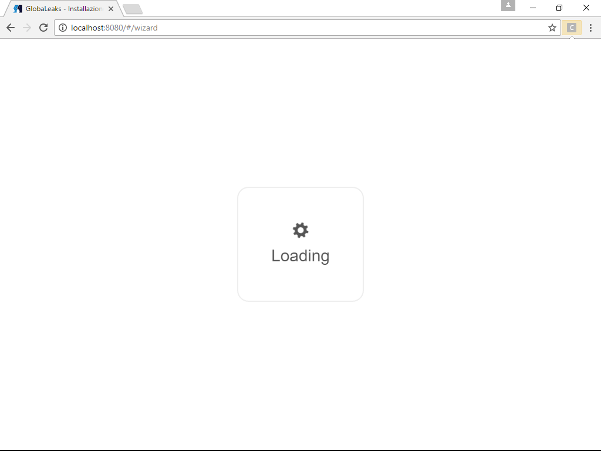
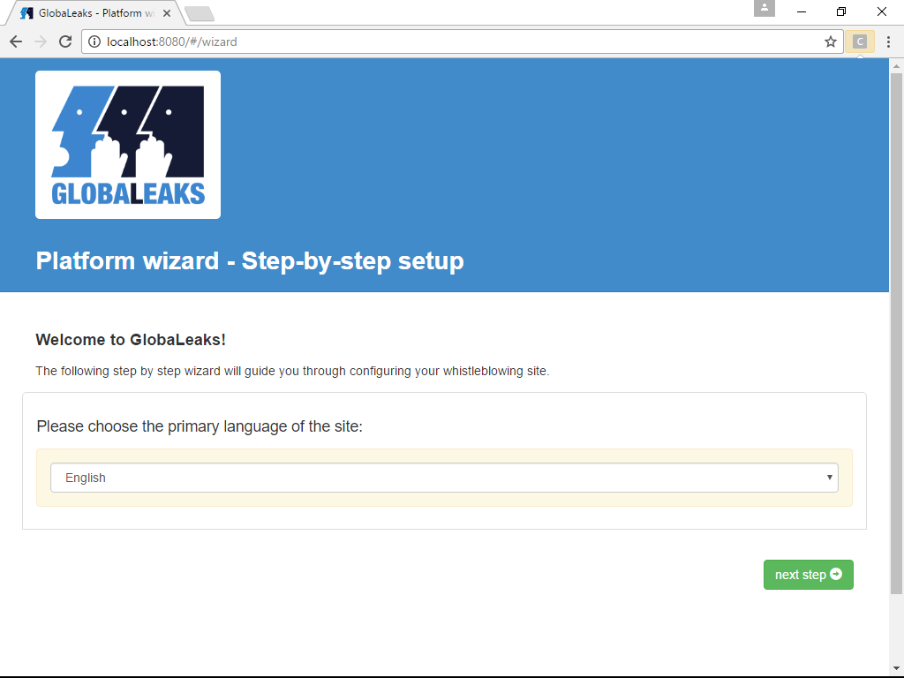
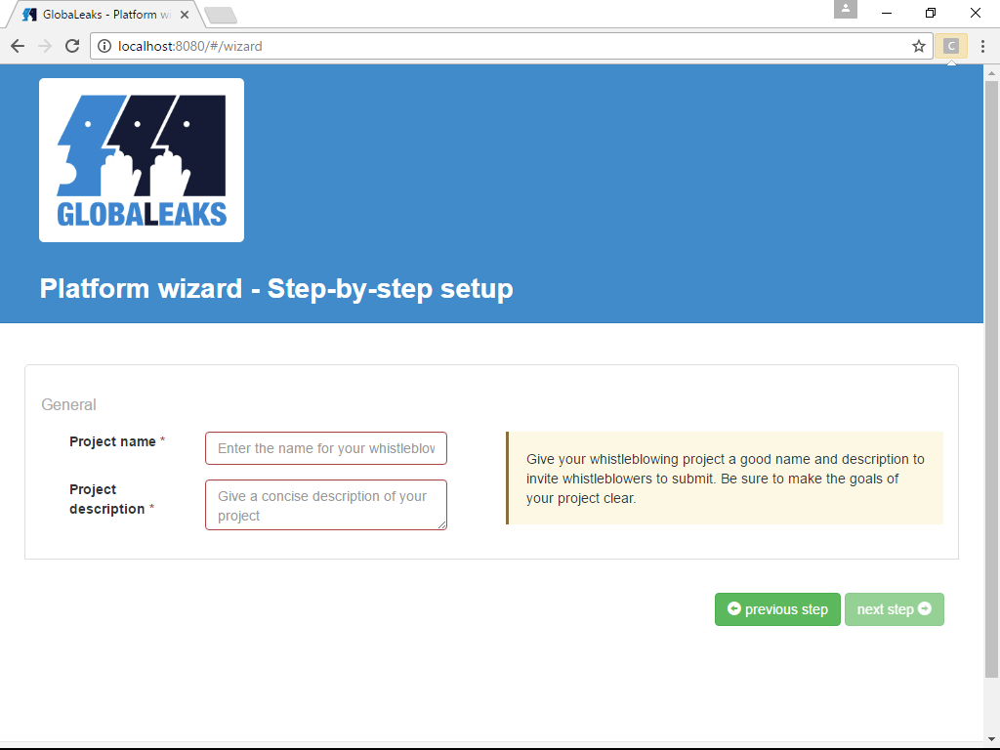
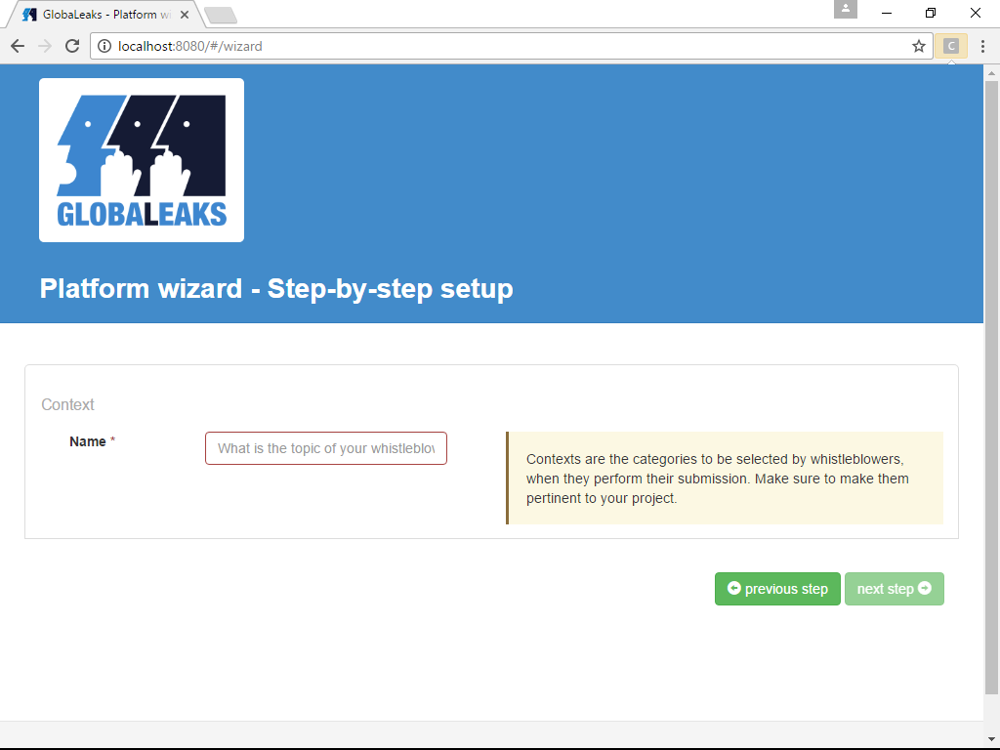
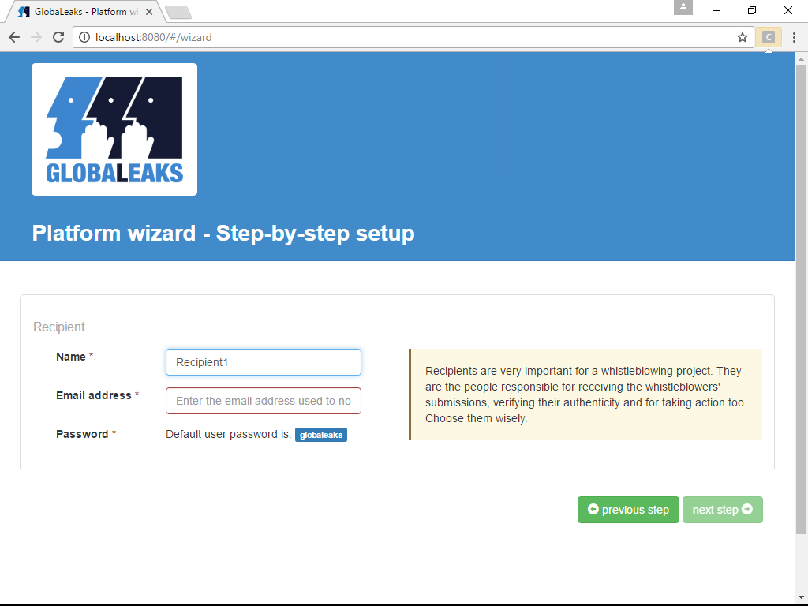
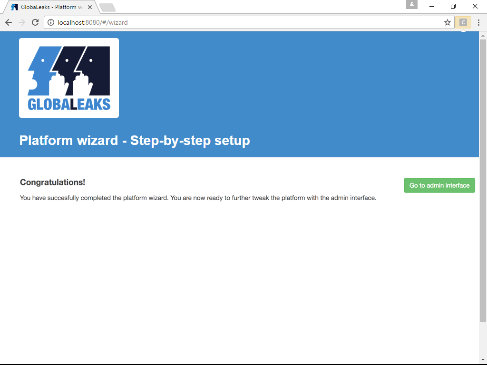

=========================
First Configuration Guide
=========================

You have just installed your GlobaLeaks and you have to make it capable of receiving anonymous submissions that get dispatched to configured recipients. To achieve this you have to access to the Platform Wizard.

STEP 1: Access Platform Wizard
-------------------------------

You can reach the Platform Wizard by your browser in two ways:

  - from the same computer you installed GlobaLeaks on: http://127.0.0.1:8080/#/wizard

  - from your Tor Hidden Service hostname with Tor Browser: Example: http://2rwejhgkn3c2z56g.onion/#/wizard

(You can find the onion address of your GlobaLeaks installation in /var/globaleaks/log/globaleaks.log some minutes after globaleaks has been launched after the successful ending of the install script)

Note that loading the interface may take a while, due to the High Latency of Tor Hidden Service

This will bring you to the page for "Step-by-step setup"

STEP 2: Choose the primary language for the site
------------------------------------------------

In this section of the wizard you select the language which will be used as primary language for your GlobaLeaks installation.
Default choice is English, but many others lanaguages are available and more are expected to be available in the future.

Once selected, click on the "next step" button to access the General section of the wizard.

STEP 3: Configure Project's name and Description
------------------------------------------------

This wizard's section is where you set up name and description of the project. 

Choose a name and description that describe your project to the intended audience of your GlobaLeaks installation.

When done, click on "next step" button to access to the section where configuring admin credentials.

STEP 4: Configure admin account
-------------------------------

This wizard's section is where you set up email adreess and password for the admin.

Keep in mind to choose a strong password in order to protect this sensitive account; an indication of the strength of the choosen password is shown to guide you in this task.

.. image:: wizard3.png

In order to proceed, click on the "next step" button.

STEP 5: Setting up a Context
-----------------------------

In this section of the configuration wizard you set up the Context (todo: insert cross-reference with matching term in Glossary).

Click on the "next step" button to proceed.

STEP 6: Setting up a Recipient for the Context
-----------------------------------------------

This is the wizard's section where you define Recipient (todo: insert cross-reference with matching term in Glossary) for the named Context.

Note that the recipient's password is set to a pre-defined value; the configured recipient will receive an email at the mail address inserted here, to change this default password to a more secure one.

Click on the "next step" button to proceed; a success page will be presented, from which you can proceed to Configure the details of your GlobaLeaks installation by accessing the Admin interface through the "Go to Admin interface" button.

